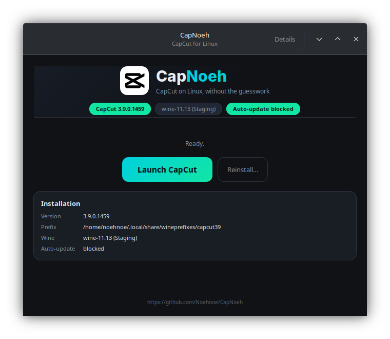

# CapNoeh Launcher

A GTK app that installs CapCut for you and then acts as its launcher.



You hand it the CapCut installer; it does the rest:

1. **Verifies the file** — SHA-256 against the known-good build, plus the
   ByteDance Authenticode signature. Refuses to continue on a mismatch
   unless you explicitly override it.
2. **Creates an isolated Wine prefix** and pre-creates the directories the
   installer needs (it hangs without them).
3. **Blocks auto-update before first launch** — otherwise CapCut updates
   itself into the 9.x build, which cannot run under Wine.
4. **Fixes the file dialog** — adds Downloads, Videos, Pictures and Home so
   you can actually find your footage.
5. **Becomes the launcher**, showing install state and warning you if the
   auto-update guard ever gets removed.

Nothing proprietary ships here. You supply the installer.

## Requirements

- `wine-staging` (**not** Proton or Bottles — they segfault the 32-bit installer)
- Python 3 with PyGObject / GTK 3
- Optional but recommended: `pip install --user signify` for signature checking

## Install

```bash
install -m755 capnoeh-launcher ~/.local/bin/capnoeh-launcher
install -m644 capnoeh-launcher.desktop ~/.local/share/applications/
update-desktop-database ~/.local/share/applications
```

Then launch **CapNoeh** from your application menu, or run `capnoeh-launcher`.

## Custom prefix

```bash
CAPNOEH_PREFIX=/path/to/prefix capnoeh-launcher
```
